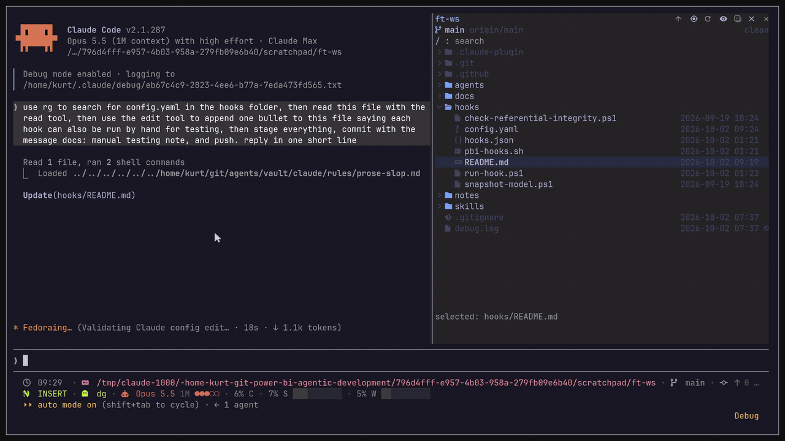

<h1 align="center">Claude Code Filetree</h1>

> **Changes in this copy** (from [data-goblin/claude-code-filetree](https://github.com/data-goblin/claude-code-filetree), MIT): `/filetree` opens in the Claude desktop app as well as fullscreen terminals (the fullscreen-only check in `hooks/register.tsx` is gone; its test is updated). Everything else is upstream's.

<p align="center">
  An IDE-style file tree for Claude Code that shows what Claude is doing and where in files
</p>

<p align="center">
  
  
  
  
</p>

<p align="center">
  
</p>

> [!NOTE]
> filetree is a Claude Code **mod** and needs **Claude Code 2.1.287+**. It shows in the right sidebar, which needs the fullscreen layout (`/tui fullscreen`) and a terminal at least 110 columns wide. Tested on Linux, macOS and Windows; mods don't load in WSL sessions of the Desktop app.

---

## Installation

The repo is its own plugin marketplace. Run this in the terminal:

```bash
claude plugin marketplace add data-goblin/claude-code-filetree
claude plugin install filetree@claude-code-filetree
```

Or inside a Claude Code session:

```text
/plugin marketplace add data-goblin/claude-code-filetree
/plugin install filetree@claude-code-filetree
```

Installed it as `filetree@filetree` before the repository was renamed? Nothing to do: that install keeps loading and keeps receiving updates.

## Features

- Interactive file tree for the working directory where you're using Claude Code; it follows the cwd, or `/filetree <path>` pins another folder
- Search the file tree, including folders you have not opened yet
- Git status per file and folder in color, with exact lines changed (`+N` `-N`) on modified files and `?:N M:N D:N` file counts on folders
- Branch, upstream and ahead/behind in the header
- Visual indicator of Claude reads and searches (purple), writes (orange) and commits (green); collapsed folders open to show the file

  

- Git and GitHub operations via `git` and `gh` (commit, push, pull, checkout, merge, PR and more) shown as a status at the bottom of the pane

  

- Selection-aware: the selected file is passed to Claude as context through a `prompt.submit` hook, and `@path` mentions in a prompt reveal that file in the tree

  

- File and folder sizes: the `Σ` header button swaps the date column for sizes; folders show their disk usage (`du`, or a summed listing on Windows), worked out in the background for the rows on screen and refreshed after Claude writes
- Double-click a file to open it in its default app
- Click to select, arrow keys to move through the tree
- Light on large repos: outside a repo it only checks once whether one exists, and every git call is scoped to the cwd
- Nerd Font icons with a plain Unicode fallback
- On Omarchy, the pane takes its colors and background from the current theme and follows theme switches

### Resizing the pane

You can resize the pane with the mouse, or by setting custom `pane:grow` or `pane:shrink` keybindings in `keybindings.json`

<p align="center">
  
</p>

## Settings

All settings are in `/config` under filetree.

- **Claude activity:** what shimmers: `reads and writes` (default), `writes`, `reads` or `none`. Git status, line counts and the git status at the bottom always show.
- **Follow Claude:** `on` (default) scrolls the tree to what Claude reads, writes or commits; `off` keeps the view where you put it, and highlights still show.
- **Right column:** `date` (default) or `size`; what the right column shows when a session starts. The `Σ` button in the header toggles it.
- **Glyphs:** `auto` (default) uses Nerd Font icons when a Nerd Font is installed and your terminal started after it was installed, plain Unicode in the desktop app, and Nerd Font over SSH. `nerd` or `plain` forces one.

## herdr

Clicking rows needs herdr 0.9.1 or later. herdr 0.9.0 and older accept pixel mouse reporting but still send cell positions, which would put every click in the session in the wrong place, so on those versions the rows ignore the mouse and the rest of the pane and session keep working. Run `herdr update` to get row clicks.

## Contributing

Turn on the pre-commit hook once per clone; it runs `claude plugin validate` and the plugin tests before each commit that touches the plugin:

```bash
git config core.hooksPath .githooks
```

The same checks run on macOS, Windows and Linux in CI on every push that touches the plugin.

## License

[MIT](LICENSE)

*This project is inspired by my Omarchy app [FileBlade](https://github.com/data-goblin/fileblade)*
