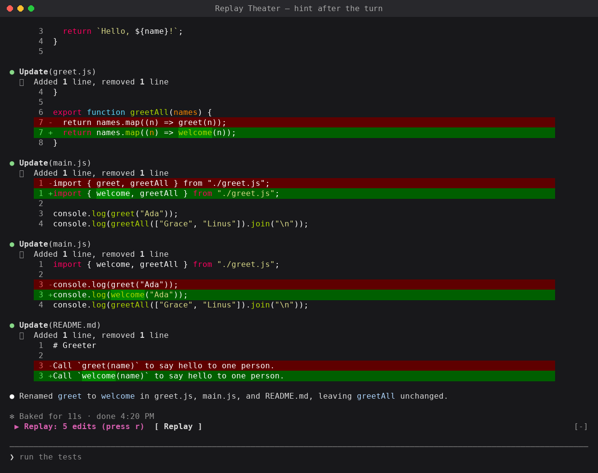
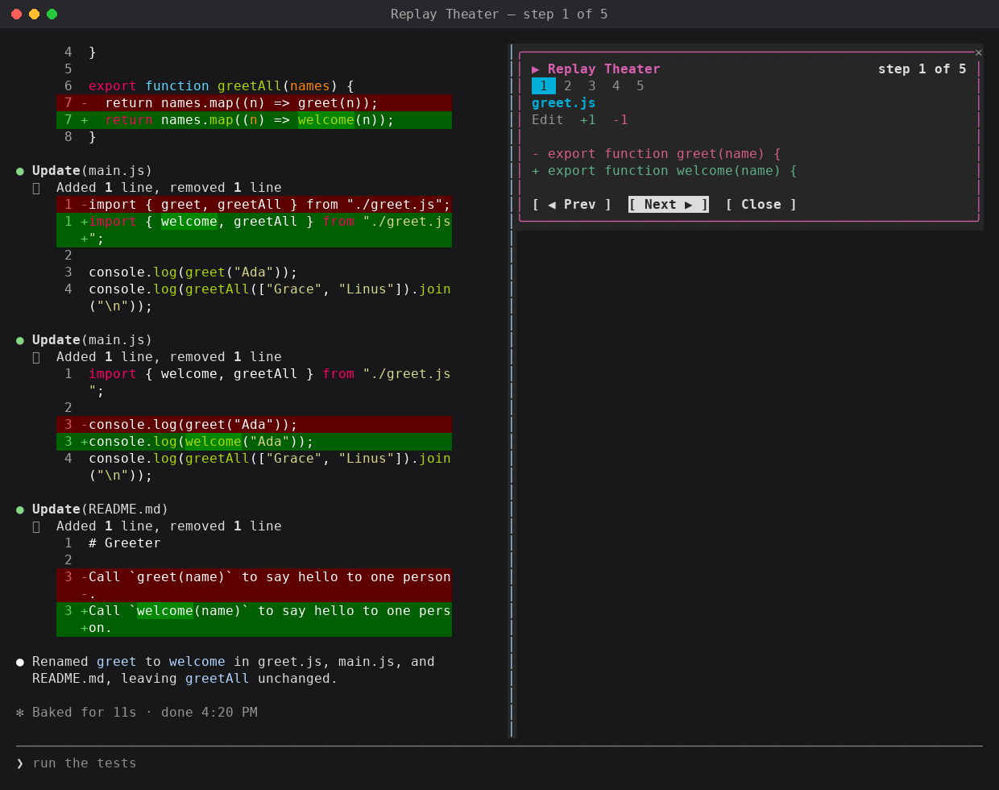
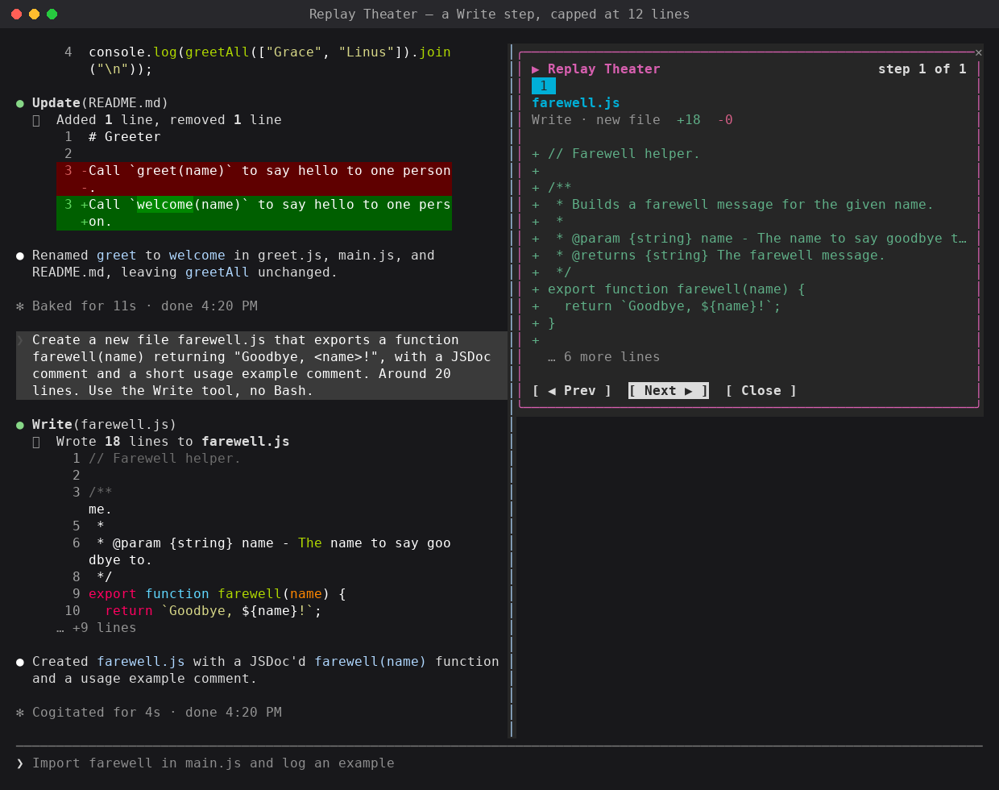
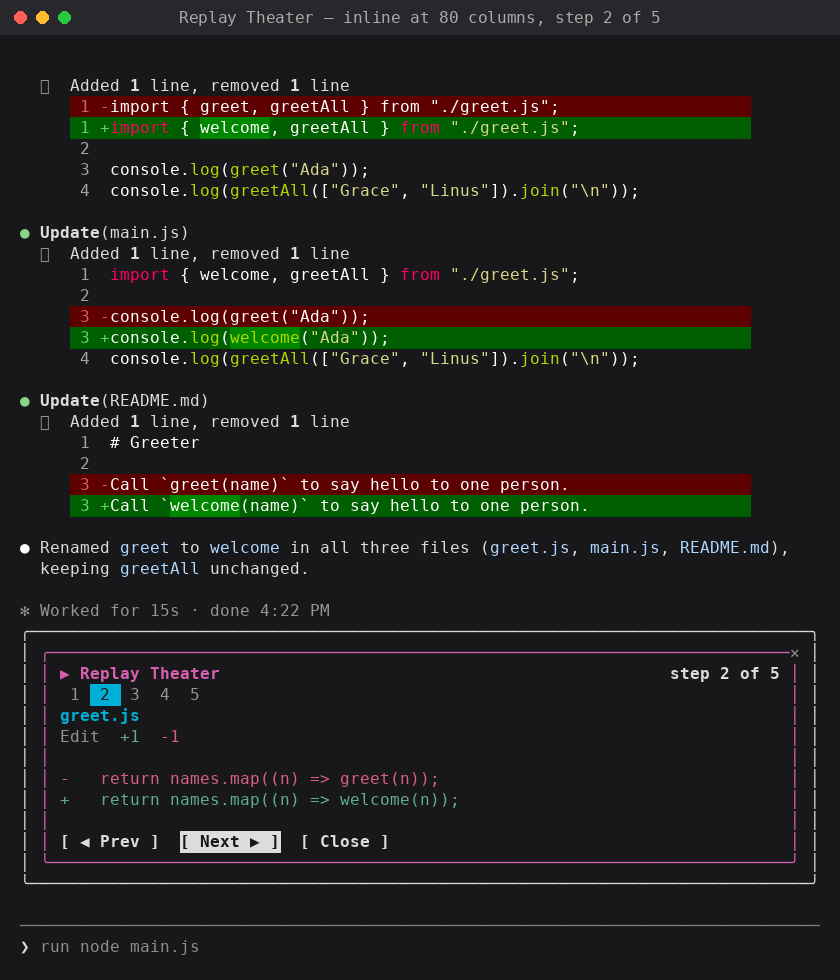

# Replay Theater

> **Changes in this copy** (from [anthropics/claude-code-playground](https://github.com/anthropics/claude-code-playground), `claude-code/mods/replay-theater`, Apache-2.0):
>
> - Records **every** tool call in a turn, not only edits: commands with their output and exit status, reads, searches, web lookups, subagents and other tools. Failed calls are kept and marked.
> - **Live**: steps appear as each call starts, with a running indicator, and fill in when it finishes; the pane and the band show "This turn · Live".
> - A desktop-app view: a summary header with a diffstat, filter segments (All, Edits, Commands, Reads, Searches), each step as a rounded chip, five at a time, scrolled with the wheel and faded at the edges, and a detail card with the diff (real line numbers), the command and its output, or the file read.
> - Paths shown relative to the session folder on Windows too; a themed band above the prompt.
>
> The description below is the original mod's.

A Claude Code mod that lets you step through the file edits Claude made in the last turn, one diff at a time. We're sharing it as an example of a mod that records tool calls without changing them and gives you a pane with buttons to review them afterwards.

## What this shows

While a turn runs, Replay Theater records each file edit Claude makes (the Edit, Write and MultiEdit tool calls): the file, and the text before and after. When the turn ends, a hint appears above the prompt:

```text
▶ Replay: 5 edits (press r)  [ Replay ]
```

Open it, and a pane shows one edit at a time: the file, the tool, a count of added and removed lines, and a short diff in red and green. A strip of numbered cells shows every step, with the current one highlighted, and the header reads "step 2 of 5". Prev, Next and Close buttons move through the steps.

Replay Theater only watches. It never blocks, changes or delays an edit.

The patterns it demonstrates:

- Recording from `tool.call` and always passing the call on with `next(e)`.
- Grouping work by turn with `turn.start` and `turn.complete`, and skipping subagent turns.
- A slash command (`/replay`) registered from `session.start` and handled in `command.run`.
- A `Pane` with `Button` elements and hotkeys, with a fallback to the `AbovePrompt` band.

## Demo

After a rename, the hint above the prompt:



The pane, on step 1 of 5:



A Write step for a new file, capped at 12 lines:



Inline above the prompt in an 80-column terminal:



## How it was built

- **Model:** built with Claude in Claude Code. The test runs and screenshots used Claude Sonnet 5. The mod itself doesn't call a model.
- **Prompt(s):** the mod started as one of ten ideas Claude wrote for mods. This is the idea as written:

  > **Replay Theater.** _Scrub through what Claude just did._ After a turn, a pane opens with a timeline of every edit. Buttons step forward and back, and each step shows its diff. It uses `ui.render` on `Pane`, with `Button` elements, and it records each edit from `tool.call`. It builds on the built-in diff mod. A developer would install it to review a long run in a minute, and it makes a strong demo clip. _A bigger project,_ because the timeline needs its own state.

  The build prompt, which picked this idea and two others by number:

  > implement 1,2,7. give me zips for them. test them in claude code and get me screenshots of what they look like when used.

- **Transcript:** not shared. The build ran in an internal workspace.
- **Iterations:**
  - The idea had the pane open by itself after each turn. The built mod shows a one-line hint above the prompt instead, and opens the pane when you ask for it with `/replay` or the Replay button.
  - A pane only takes the keyboard while nothing else holds it. When the band's Replay button is pressed, the band holds the keys, so the mod hides the band and waits briefly before it opens the pane.
  - A Write can replace a whole file, so the diff keeps only one line of context around each change, and caps each step at 12 lines.
  - Tested in Claude Code: a rename across three files made 5 edits, and the pane stepped through all of them with Prev, Next and Close. A Write of a new file showed as one step.

## Run it

**Requirements:**

- Claude Code 2.1.287 or later, where mods load by default. The mod was built and tested on 2.1.280, and `claude plugin validate` passes on 2.1.285.
- A terminal. The pane is placed inline above the prompt, or docked to the right in the fullscreen layout.

No environment variables or configuration.

**Steps:**

1. Clone this repository and go to this folder's parent:

   ```bash
   git clone https://github.com/anthropics/claude-code-playground.git
   cd claude-code-playground/claude-code/mods
   ```

2. Check the plugin:

   ```bash
   claude plugin validate ./replay-theater
   ```

3. Try it for one session:

   ```bash
   claude --plugin-dir ./replay-theater
   ```

   Or install it, with the other mods here, from the local marketplace in this folder (see the [mods README](../README.md)):

   ```bash
   claude plugin marketplace add ./
   claude plugin install replay-theater@claude-code-playground-mods --scope user
   ```

4. Ask Claude for a change that edits files, for example "rename the function greet to welcome everywhere".
5. When the turn ends, open the replay in one of two ways:
   - Type `/replay` and press Enter.
   - Press `ctrl+x` then `Tab` to focus the band above the prompt, then press `r` (or Enter on the Replay button).
6. In the pane:

   | Key | Does |
   |---|---|
   | `n` | Next step |
   | `p` | Previous step |
   | `c` or `Escape` | Close the pane |

   Mouse clicks on the buttons work too. The replay stays available until the next turn that edits files. A turn with no edits keeps the previous replay.

## Notes / limitations

- The diff shows up to 12 lines per step, then "… N more lines". Unchanged lines are kept only next to a change, and a skipped run shows as "⋯".
- For Edit, the diff is between `old_string` and `new_string`, not the whole file. The file's line numbers aren't shown.
- For Write, the old text is read from disk just before the write. Files over 400 lines are shown as all removed, then all added, with no line matching.
- Edits are recorded when the tool is called. An edit that you then deny, or that fails, still shows in the replay.
- The replay is kept in memory for the current session only. It is lost when Claude Code restarts, or when the plugin reloads.
- Edits made by subagents are included in the main turn's replay.
- Claude Code 2.1.280 has no MultiEdit tool. The mod handles MultiEdit, one step per edit, for builds that have it. That path is untested.
- If the terminal can't place a pane, the replay is drawn in the band above the prompt instead. That fallback is untested, because every width we tried (80 and 120 columns) placed the pane.
- The band above the prompt is shared. If another mod also draws there, only one of them shows.

## Dependencies

| Name | Version | License (SPDX) | Source |
| --- | --- | --- | --- |
| None | | | |

## Third-party notices

None.

---

Shared as-is as part of claude-code-playground. Not an official Anthropic product; no support or maintenance is implied. See the root README and LICENSE.
